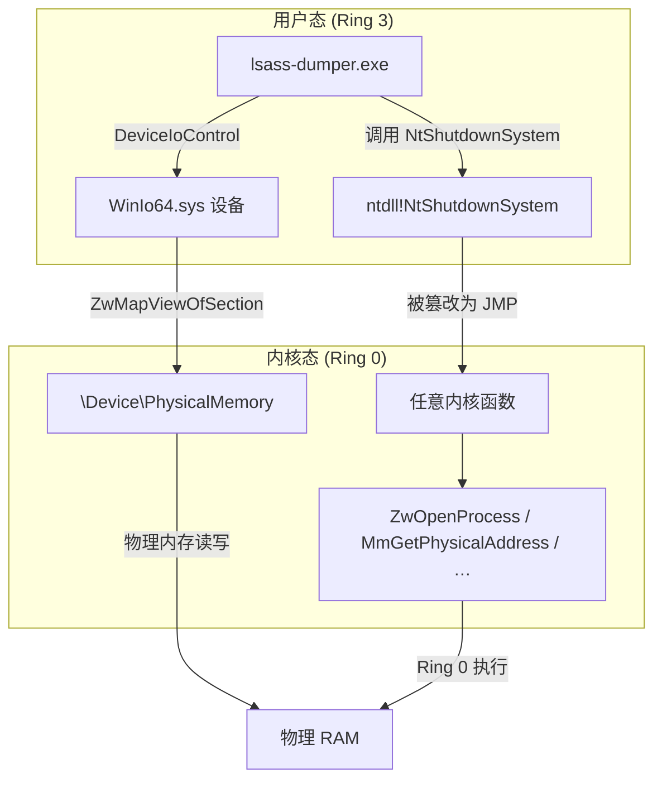
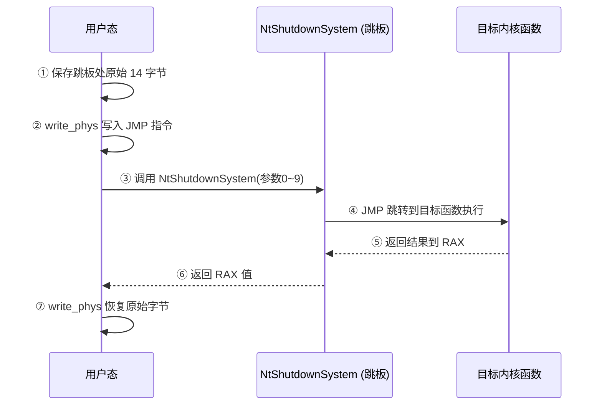
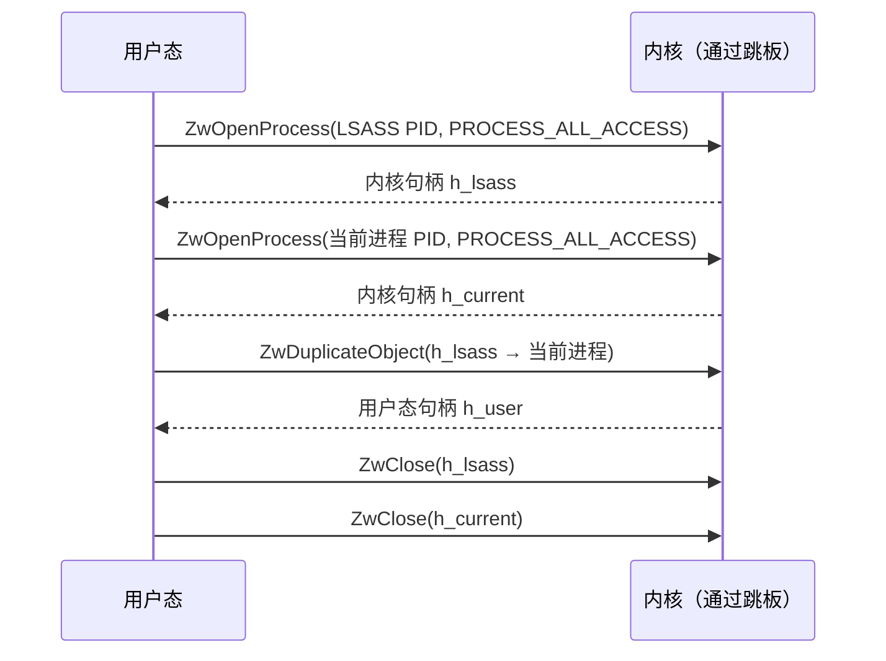
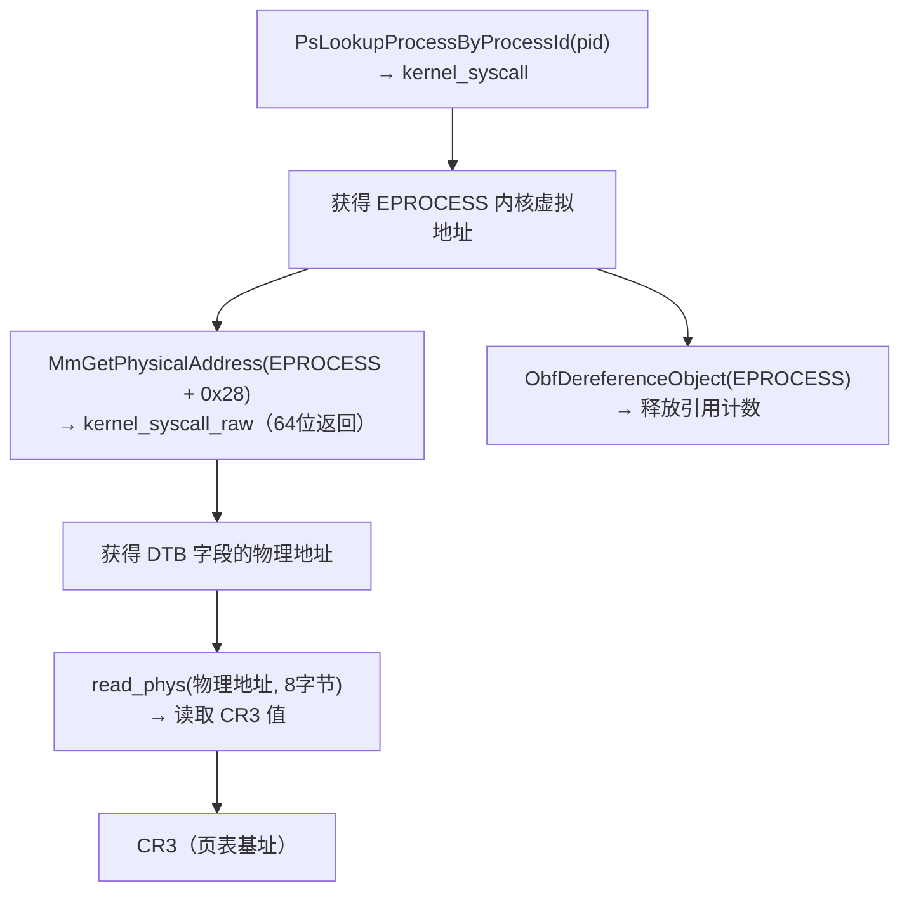
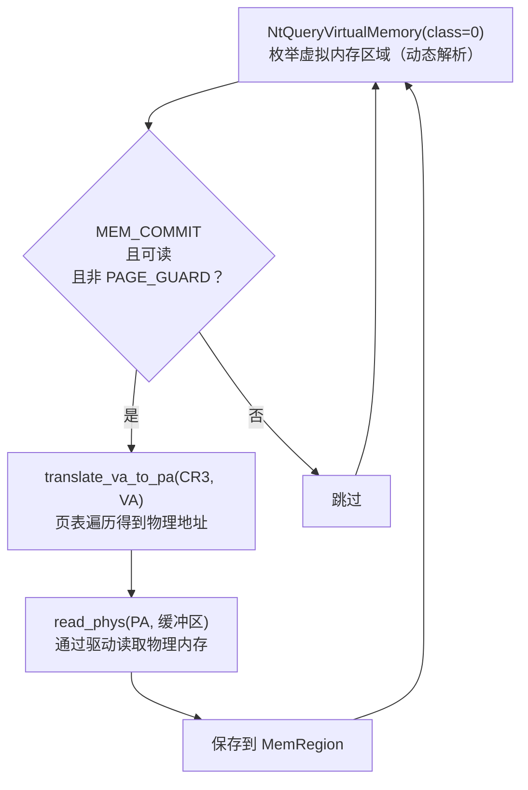
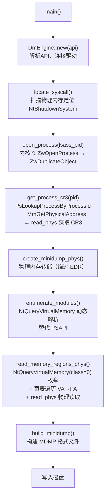

# WinIo64 DM_KernelSyscall 引擎 — 技术细节文档

## 整体架构



**核心思路**：利用 WinIo64.sys 提供的物理内存映射能力，找到 `ntoskrnl!NtShutdownSystem` 在物理内存中的位置，将其替换为跳转指令（JMP），从而在用户态触发任意内核函数执行。

---

## 阶段一：引擎初始化

**文件**：[winio64.rs](file:///c:/Users/code/Desktop/Tool/Rust/lsass-dumper/src/winio64.rs#L65-L181)

### 1.1 API 动态解析（无 IAT 导入）

所有 Win32 API 通过 PEB 遍历 + 自定义哈希算法解析，**不在导入表中留下任何痕迹**：

| API | 查找来源 | 用途 |
|-----|---------|------|
| `CreateFileW` | kernel32 | 打开驱动设备 |
| `DeviceIoControl` | kernel32 | 发送 IOCTL |
| `CloseHandle` | kernel32 | 关闭句柄 |
| `NtShutdownSystem` | ntdll | 用作内核跳板（trampoline） |

### 1.2 驱动设备连接

```rust
CreateFileW("\\\\.\\WinIo", GENERIC_READ | GENERIC_WRITE, OPEN_EXISTING)
```

设备路径通过 `obfstr` 运行时 XOR 解密，二进制中不存在明文字符串。

### 1.3 跳板定位（[locate_syscall](file:///c:/Users/code/Desktop/Tool/Rust/lsass-dumper/src/winio64.rs#388-473)）

**目标**：在物理内存中找到 `NtShutdownSystem` 的内核代码页，用于后续篡改和触发。


**扫描细节**：
- 物理内存范围从注册表读取：`HKLM\HARDWARE\RESOURCEMAP\System Resources\Physical Memory\.Translated`
- ntoskrnl 加载在 2MB 对齐的物理地址，只检查对齐的候选位置
- 匹配条件：`候选物理基址 + NtShutdownSystem RVA` 处的 32 字节与磁盘文件一致

### 1.4 虚拟基址计算

```
ntos_virt_base = 用户态 NtShutdownSystem 地址 - NtShutdownSystem RVA
```

通过 ntdll 中用户态函数地址反推 ntoskrnl 内核虚拟基址，后续用于定位其他内核导出函数。

---

## 阶段二：物理内存读写原语

**文件**：[winio64.rs](file:///c:/Users/code/Desktop/Tool/Rust/lsass-dumper/src/winio64.rs#L187-L265)

### WinIo64 IOCTL 接口

| IOCTL | 控制码 | 功能 |
|-------|--------|------|
| `MAPPHYSTOLIN` | `0x80102040` | 物理地址 → 用户态虚拟地址映射 |
| `UNMAPPHYSADDR` | `0x80102044` | 取消映射 |

> 控制码通过 XOR 对在运行时计算，**不以常量形式出现在 `.rdata` 段**。

### PhysStruct 数据结构（40 字节）

```
偏移    大小   字段              说明
0x00    8     size              输入：映射大小
0x08    8     phys_addr         输入：物理地址
0x10    8     section_handle    输出：Section 句柄
0x18    8     mapped_va         输出：用户态虚拟地址
0x20    8     section_object    输出：Section 对象
```

### 驱动内部实现

WinIo64 在内核中依次调用：
1. `ZwOpenSection("\Device\PhysicalMemory")` — 打开物理内存 Section
2. `ZwMapViewOfSection(section, process, &va, phys_addr, size)` — 映射到用户态
3. 返回映射后的用户态虚拟地址

> **关键优势**：基于 Section 的映射会创建**独立的 PTE（页表项）**，拥有独立的读写权限。即使内核代码页本身是只读的，通过 Section 映射的副本也可以写入。这是 WinIo64 优于 `MmMapIoSpace` 方案（如 sfdrvx64）的核心区别。

### 读写封装

```
read_phys(物理地址, 缓冲区):
    map_phys(物理地址, 大小) → 用户态虚拟地址
    memcpy(虚拟地址 → 缓冲区)
    unmap_phys()

write_phys(物理地址, 数据):
    map_phys(物理地址, 大小) → 用户态虚拟地址
    memcpy(数据 → 虚拟地址)
    unmap_phys()
```

---

## 阶段三：内核系统调用核心

**文件**：[winio64.rs](file:///c:/Users/code/Desktop/Tool/Rust/lsass-dumper/src/winio64.rs#L530-L568)

### 执行机制



### JMP Shellcode（14 字节）

```
FF 25 00 00 00 00           ; jmp [rip+0]（间接跳转）
xx xx xx xx xx xx xx xx     ; 目标函数虚拟地址（8字节）
```

### 跳板函数签名

```rust
type FnTrampoline = unsafe extern "system" fn(
    usize, usize, usize, usize, usize,  // 参数 0-4：RCX, RDX, R8, R9, 栈
    usize, usize, usize, usize, usize,  // 参数 5-9：栈
) -> usize;  // 返回 64 位完整 RAX
```

> **重要改动**：返回类型从 [i32](file:///c:/Users/code/Desktop/Tool/Rust/lsass-dumper/src/resolver.rs#172-176) 改为 `usize`（x64 上为 64 位）。原因是 `MmGetPhysicalAddress` 等函数返回 64 位物理地址，[i32](file:///c:/Users/code/Desktop/Tool/Rust/lsass-dumper/src/resolver.rs#172-176) 只能捕获低 32 位，导致地址截断错误。

### 两种调用方式

| 方法 | 返回类型 | 适用场景 |
|------|---------|---------|
| [kernel_syscall()](file:///c:/Users/code/Desktop/Tool/Rust/lsass-dumper/src/winio64.rs#530-535) | [i32](file:///c:/Users/code/Desktop/Tool/Rust/lsass-dumper/src/resolver.rs#172-176)（NTSTATUS） | ZwOpenProcess、ZwClose 等返回状态码的函数 |
| [kernel_syscall_raw()](file:///c:/Users/code/Desktop/Tool/Rust/lsass-dumper/src/winio64.rs#536-569) | [u64](file:///c:/Users/code/Desktop/Tool/Rust/lsass-dumper/src/kernel_rw.rs#205-210)（完整 RAX） | MmGetPhysicalAddress 等返回 64 位值的函数 |

---

## 阶段四：目标进程句柄获取

**文件**：[winio64.rs](file:///c:/Users/code/Desktop/Tool/Rust/lsass-dumper/src/winio64.rs#L575-L669)



**结果**：获得 LSASS 进程的 `PROCESS_ALL_ACCESS` 句柄，该句柄在用户态进程句柄表中可直接使用。

---

## 阶段五：CR3 获取

**文件**：[winio64.rs](file:///c:/Users/code/Desktop/Tool/Rust/lsass-dumper/src/winio64.rs#L671-L727)

CR3 是目标进程的页表基址（`DirectoryTableBase`），存储在 `EPROCESS` 结构的 `+0x28` 偏移处（x64 全版本稳定）。



> **历史问题**：最初尝试使用 `MmCopyMemory` 将 CR3 直接复制到用户态缓冲区，导致 BSOD。原因是 `MmCopyMemory` 要求目标缓冲区在**非分页内核内存**中，用户态栈地址不满足此条件。改用 `MmGetPhysicalAddress` + [read_phys](file:///c:/Users/code/Desktop/Tool/Rust/lsass-dumper/src/winio64.rs#246-255) 的两步方案安全可靠。

---

## 阶段六：物理内存 Minidump 构建

**文件**：[minidump.rs](file:///c:/Users/code/Desktop/Tool/Rust/lsass-dumper/src/minidump.rs#L174-L401)

### 6.1 模块枚举（已脱离 PSAPI）

| 对比项 | 旧方案（被 EDR 拦截） | 新方案 |
|--------|---------------------|--------|
| API | `EnumProcessModulesEx`（PSAPI，IAT） | `NtQueryVirtualMemory`（动态解析） |
| 模块信息 | `GetModuleInformation`（PSAPI，IAT） | PE 头解析获取 `SizeOfImage` |
| 模块名 | `GetModuleFileNameExW`（PSAPI，IAT） | `NtQueryVirtualMemory(class=2)` |

新方案通过 `VirtualQueryEx` 遍历虚拟内存区域，检测 `MEM_IMAGE` 类型且 `BaseAddress == AllocationBase` 的区域（即模块起始页），然后用 `NtQueryVirtualMemory(MemoryMappedFilenameInformation)` 获取映射文件名，再通过 `QueryDosDeviceW` 将 NT 设备路径转换为 DOS 路径。

### 6.2 内存区域读取（物理内存路径）



> **核心优势**：整个内存读取过程不调用 `NtReadVirtualMemory`，完全通过物理内存通道，**绕过所有用户态 EDR hook**。

### 6.3 x64 四级页表遍历（[translate_va_to_pa](file:///c:/Users/code/Desktop/Tool/Rust/lsass-dumper/src/minidump.rs#228-280)）

```
虚拟地址位分解:
┌─────────┬─────────┬─────────┬─────────┬─────────┬─────────────┐
│ 63:48   │ 47:39   │ 38:30   │ 29:21   │ 20:12   │ 11:0        │
│ 符号扩展 │ PML4 索引│ PDPT 索引│ PD 索引  │ PT 索引  │ 页内偏移     │
└─────────┴─────────┴─────────┴─────────┴─────────┴─────────────┘

CR3 ─── & 0x000FFFFFFFFFF000（去除 PCID 位）
          │
          ├─ PML4E = read_phys(CR3基址 + PML4索引 × 8)
          │    └─ bit 0 == 0 → 页不存在，返回错误
          │
          ├─ PDPTE = read_phys(PML4E基址 + PDPT索引 × 8)
          │    ├─ bit 7 == 1 → 1GB 巨页，直接计算物理地址
          │    └─ 否则 → 继续下一级
          │
          ├─ PDE = read_phys(PDPTE基址 + PD索引 × 8)
          │    ├─ bit 7 == 1 → 2MB 大页，直接计算物理地址
          │    └─ 否则 → 继续下一级
          │
          └─ PTE = read_phys(PDE基址 + PT索引 × 8)
               └─ 物理地址 = (PTE & 掩码) | (VA & 0xFFF)
```

支持三种页面大小：**4KB 标准页**、**2MB 大页**、**1GB 巨页**。已换出（paged out）的页面返回全零填充，不中断转储。

---

## 反检测总结

| 检测向量 | 旧实现 | 新实现 | 状态 |
|---------|--------|--------|------|
| API 哈希算法 | DJB2（`imul 0x21`，已知指纹） | 自定义 salted（`imul 0x83`） | ✅ 已规避 |
| PSAPI 导入表 | EnumProcessModulesEx 等 3 个函数 | 已完全移除 | ✅ 已规避 |
| NtReadVirtualMemory | 用户态调用 → EDR hook 拦截 | 物理内存 [read_phys](file:///c:/Users/code/Desktop/Tool/Rust/lsass-dumper/src/winio64.rs#246-255) | ✅ 已规避 |
| 字符串特征 | LSASS / PPL / BYOVD 等明文 | `obfstr` 编译期 XOR 加密 | ✅ 已规避 |
| IOCTL 常量 | 明文存储在 `.rdata` | XOR 对运行时计算 | ✅ 已规避 |
| CLI 帮助文本 | 暴露工具功能和驱动名 | 通用化中性描述 | ✅ 已规避 |

---

## 完整调用链


